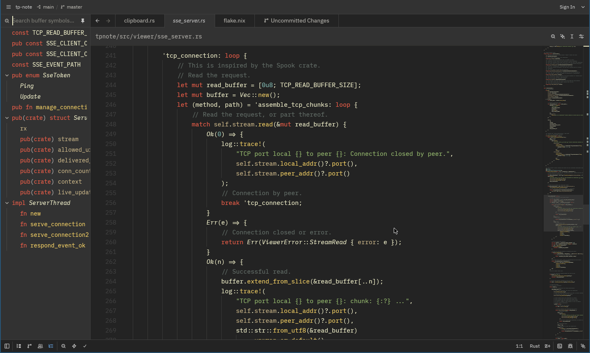

# Autumn Theme

A warm, earthy color scheme for [Zed](https://zed.dev/) inspired by autumn colors.

## Overview

Autumn is a dark theme with a warm, earthy palette featuring golden yellows, deep greens, and soft terracotta accents.

## History & Attribution

This theme has a rich history spanning multiple editors and authors:

1. **Original concept** — The "Autumn" color scheme was originally designed for the Komodo IDE
2. **Vim port** — Kenneth Love and Chris Jones ported it to Vim
3. **Improvements** — Yorick Peterse further improved the Vim version ([Autumn.vim](https://github.com/YorickPeterse/Autumn.vim))
4. **Helix & Zed ports** — Jens Getreu ported and optimized the theme for both the Helix editor and Zed

Most of the colors come from the original Autumn theme, inspired by the colors of autumn.

## Features

- **Dark background** — Easy on the eyes for extended coding sessions
- **Warm palette** — Golden yellows, earthy greens, and terracotta tones
- **High contrast** — Code elements remain clearly distinguishable
- **Terminal colors** — Fully themed terminal with ANSI color support
- **Git gutter colors** — Clear visual distinction for additions, modifications, and deletions

## Installation

### Via Zed (recommended)

1. Open Zed
2. Open the command palette (`Cmd+Shift+P` / `Ctrl+Shift+P`)
3. Type "Zed: Install Theme"
4. Search for "Autumn" and install it

### Manual

1. Clone this repository
2. Copy the `extensions/zed-theme-autumn` directory into your Zed extensions directory
3. Restart Zed

### Via `zeditor extensions install`

```bash
zeditor extensions install autumn
```

## Usage

After installation, activate the theme:

1. Open command palette
2. Type "Zed: Change Theme"
3. Select "Autumn"

Or add this to your `settings.json`:

```json
{
  "theme": "Autumn"
}
```

## Screenshots



## License

This theme is available as open-source under the terms of the [MIT License](https://github.com/getreu/zed-theme-autumn/blob/master/LICENSE).

## Acknowledgements

This theme was originally designed for Komodo IDE. The Vim version was created by Kenneth Love, Chris Jones, and improved by Yorick Peterse ([Autumn.vim](https://github.com/YorickPeterse/Autumn.vim)). The Helix and Zed ports were created by Jens Getreu.
